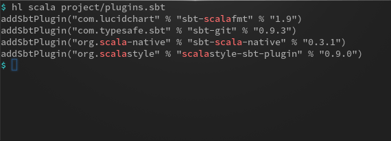
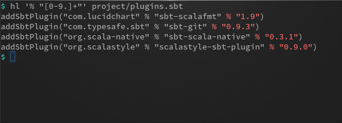
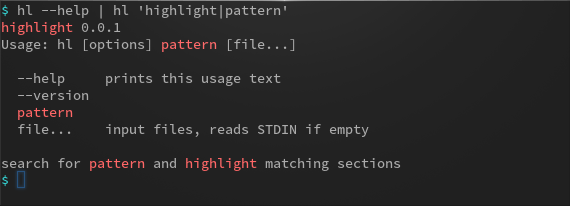

# highlight

Searches for a pattern or regular expression (regex) and highlights matches.

## Usage

The simplest form of usage is to highlight a pattern in a file:

You can also use a regular expression as pattern:

Also, usage within pipes is possible:

